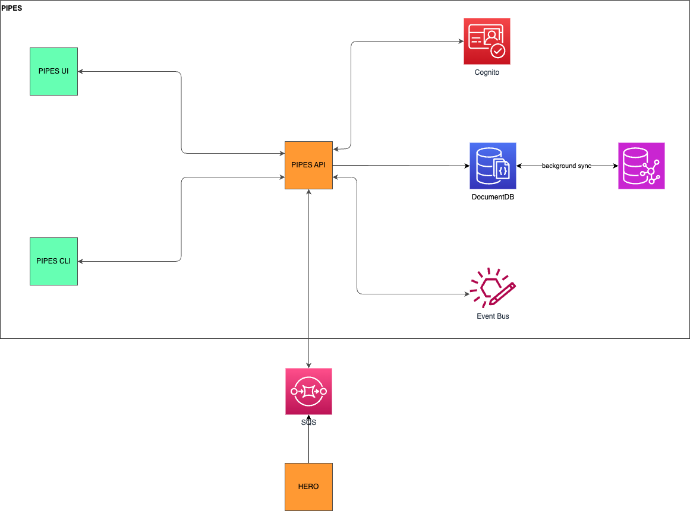

## PIPES API

The design documentation of PIPES API.


### 1. Architecture

The draft diagram of PIPES architecture




### 2. Document

User
```json
{
    "_id": "u1",
    "email": "first_name.last_name@example.com",
    "username": "flast", // optional
    "first_name": "first_name",
    "last_name": "last_name",
    "role": "viwer",
}
```

Team
```json
{
    "_id": "t1",
    "name": "dgen",
    "full_name": "",
    "description": "",
    "members": ["u1", "u2", "u3"],
}
```

Project
```json
{
    "name": "test1",
    "full_name": "Test1 Project in Solar",
    "description": "This is test1 project description",
    "teams": ["t1", "t2", "t3", ...],
}
```

### 3. Graph

* Vertex
* Edge
* Property
